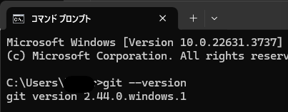
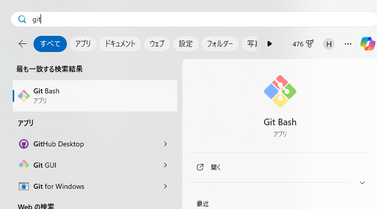
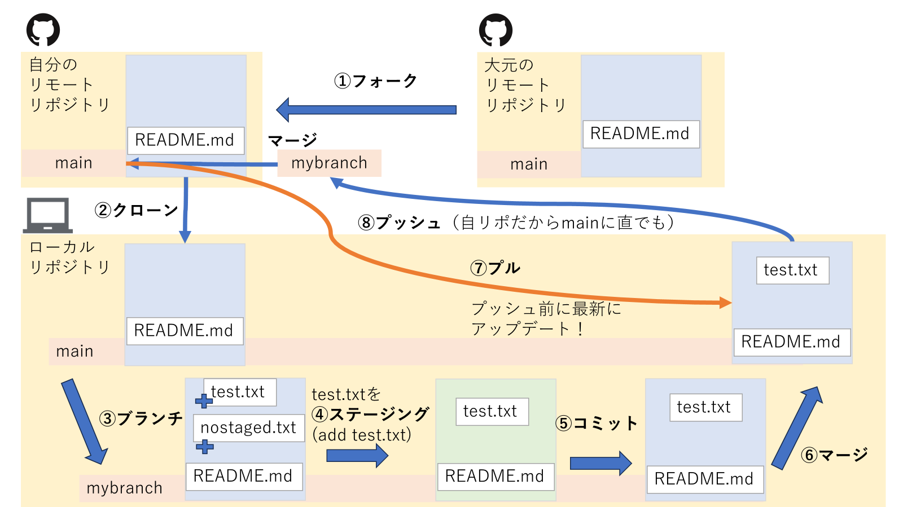
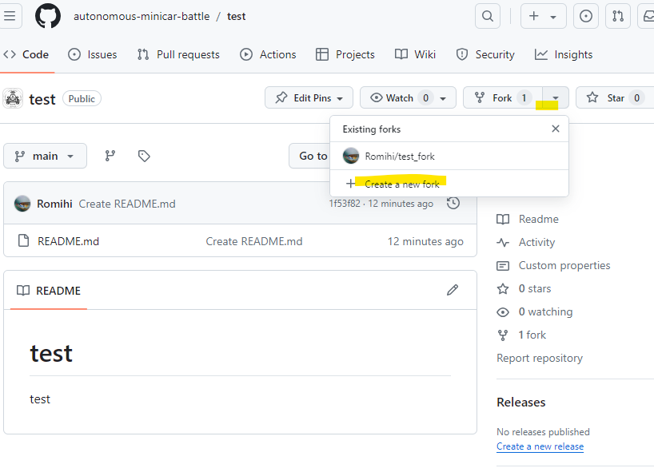
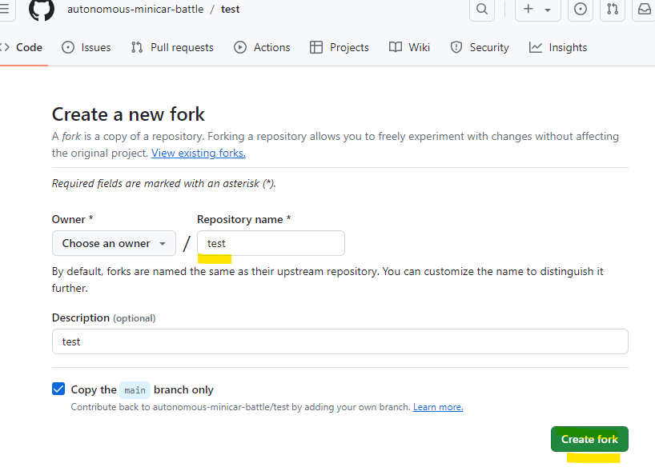
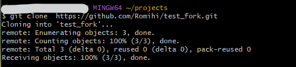
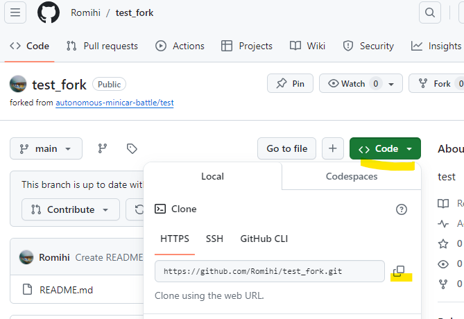
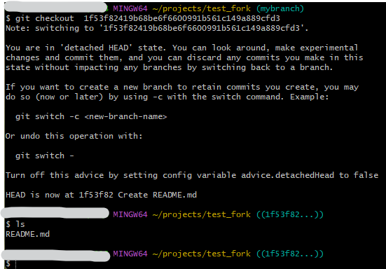
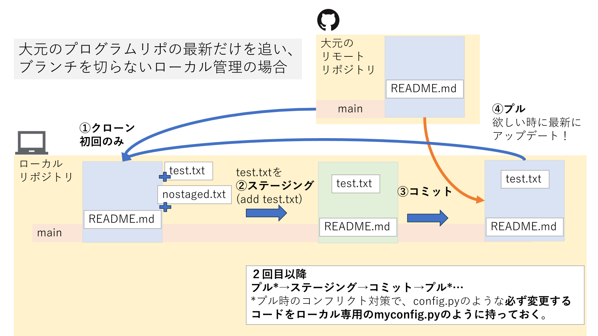
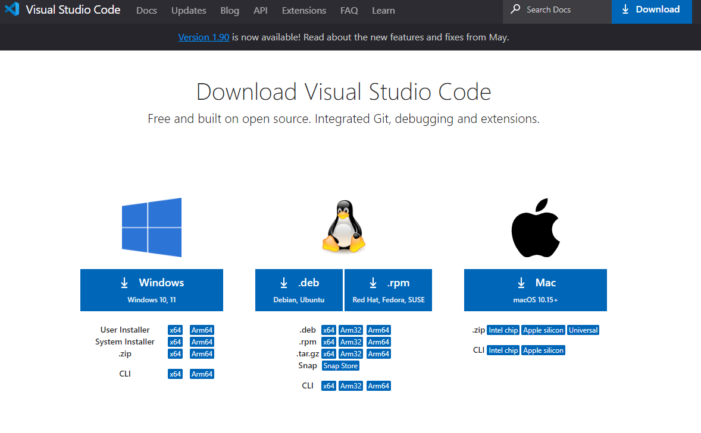

# development

開発ツール講座資料や各種ツール紹介

## 開発ツール講座実施記録

- 2024/6/29@Zoom

## 開発ツール講座実施内容

0. Gmailアカウント(個人開発用)作成
1. Python基礎
2. GoogleColabの使い方
3. Github・Gitの導入
4. Visual Studio Code(vscode)の紹介
5. 超音波センサマシン2Dシミュレータ on GoogleColab

その他チップス

## 0. Googleアカウントを作成しGmailアドレス(個人開発用)を取得

### 💡 できれば事前に実施ください

 1. [リンク](https://support.google.com/accounts/answer/27441?hl=ja)を参考にGoogleアカウントを作成し、Gmailアドレス事前に作成してください。  
GmailアドレスはGit, Githubで使います。  
また、シミュレータの利用やクラウド上で機械学習を実施するたにGoogleColabが利用できる必要があります。

## 1. Python基礎

　[資料]()をベースに実施予定

## 2. GoogleColabの使い方

## 3. Github・Gitの導入

### 📄概要

- **Git**: プログラムの変更履歴を管理するツールで、複数の人が同時に作業する際に便利です。各開発者は自分のコンピュータに完全なコピーを持ち、オフラインでも作業できます。

- **GitHub**: Git リポジトリをインターネット上で共有し、協力してソフトウェアを開発できるプラットフォームです。プロジェクトのトラッキング、問題管理、コードレビュー、そして他の開発者とのコラボレーションが容易になります。
  
    👇  
    Gitはコードの管理をするツールでGithubはGitの機能を使い、  
    ネット上でみんなで共同同時作業ができます。  
    今回の自動運転ミニカーバトルでは、基本となるコードをGithubで配布します。  
    皆さんの手元のPCかマシン上でGitを使って、日々のコード管理を実施できるとよいと思います。

### ⬇インストール、利用準備

### 💡 できれば事前に実施ください

- [Gitのインストール](https://git-scm.com/book/ja/v2/%E4%BD%BF%E3%81%84%E5%A7%8B%E3%82%81%E3%82%8B-Git%E3%81%AE%E3%82%A4%E3%83%B3%E3%82%B9%E3%83%88%E3%83%BC%E3%83%AB) 　
ここでは、Windows PCでのインストールを紹介します。  
<http://git-scm.com/download/win> にアクセスすると、ダウンロードが始まります。  

    👇  
    配布マシン（ラズパイ）にはデフォルトで入ってます。

- Githubのアカウント作成
    <https://github.com/>　からアクセスし、アカウントを作成する
    必要なもの: ユーザー名、メールアドレス（上記のGmailを使いましょう）、パスワード  
    [手順参考参考](https://qiita.com/rshibasa/items/f62db870ed573ca4dced)

### ✅Gitの確認

コマンドプロンプトから下記のコマンドでgitのバージョンが出てくればOKです。

~~~
git --version
~~~

windowsでは、下記のようにgit bashがインストールされていればOKです。以降ではまずgit bashを使っていきます。
<<<<<<< HEAD

### 👌Gitの設定
~~~shell
git config --global user.name "あなたのユーザーネーム"
git config --global user.email "あなたのメールアドレス"
~~~
=======

>>>>>>> 4b2005626add6302e9dfe69cb9e0eafce11b321c

### 👌Gitの理解

#### 単語集

| **順番** | **用語**                        | **説明**                                                                   | **コマンド**                                    |
| -------- | ------------------------------- | -------------------------------------------------------------------------- | ----------------------------------------------- |
| -        | リポジトリ (Repository)         | プロジェクトやファイルの管理を行うデータベースのような場所。               | -                                               | - |
| 1        | フォーク (Fork)                 | 他のユーザーのリポジトリを自分のアカウントにコピーすること。               | -                                               |
| 2        | クローン (Clone)                | リモートリポジトリ（通常はGitHubなど）からローカルにコピーを作成すること。 | `git clone <リポジトリのURL>`                   |
| 3        | ブランチ (Branch)               | リポジトリ内での開発の流れを分岐させるためのもの。                         | `git branch <ブランチ名>`                       |
| 4        | チェックアウト (Checkout)       | 特定のブランチやコミットに切り替えること。                                 | `git checkout <ブランチ名>`                     |
| 5        | ステージング (Staging)          | 変更をコミットの対象として準備すること。                                   | `git add <ファイル名>` or `git add .`           |
| 6        | コミット (Commit)               | ファイルの変更をリポジトリに記録すること。                                 | `git commit -m "コミットメッセージ"`            |
| 7        | プル (Pull)                     | リモートリポジトリから最新の変更を取得してくること。                       | `git pull origin <ブランチ名>`                  |
| 8        | プッシュ (Push)                 | ローカルでの変更をリモートリポジトリにアップロードすること。               | `git push origin <ブランチ名>`                  |
| 9        | マージ (Merge)                  | 異なるブランチの変更内容を統合すること。                                   | `git merge <ブランチ名>`                        |
| 10       | プルリクエスト (Pull Request)   | 変更内容を元のリポジトリに統合してもらうためのリクエスト。                 | -                                               |
| 11       | スタッシュ（Stash）             | 現在の作業ディレクトリの一時的な変更を一時的に保存する機能。               | `git stash`、`git stash apply`、`git stash pop` |
| -        | ローカル (Local)                | 自分のコンピュータ上の環境やファイルを指すこと。                           | -                                               |
| -        | リモート (Remote)               | インターネット上でアクセス可能なリポジトリのこと。                         | -                                               |
| -        | コンフリクト (Conflict)         | 異なる箇所で同時に変更が加えられており、Gitが自動で解決できない状態。      | -                                               |
| -        | ブランチのマージ (Branch Merge) | 異なるブランチの変更を統合する操作。                                       | -                                               |

一旦変更を置いておくgit stashは今回利用しません。  
また、コンフリクトの解消等につきましては、時間の都合割愛します。

### イメージ

#### 一連の流れの練習

0. フォーク：
リモートリポジトリ（通常はGitHub上）で他の人のプロジェクトを自分のアカウントにコピーします。これにより、自分のアカウントで変更を加えることができます。  
今回は自動運転ミニカーバトル内のtestリポをフォークします。

名前を付けて自分のリポに追加します。

フォークが完了すると下記のように自分のリポ内にフォークしてきたリポが出来上がります。

1. クローン：
リモートリポジトリ（GitHubなど）にあるコードをローカル環境にコピーします。  

~~~
git clone https://github.com/Romihi/test_fork.git
~~~

リポジトリのURLは下記のように**code**の部分から取得できます。

2. ブランチとチェックアウト:
mainブランチから新しいブランチ（ここでは"mybranch"という名前）を作成し、そのブランチに移動します。git statusをやらなくても、git bashを使っている場合はブランチが見えています。

~~~
git branch mybranch
git checkout mybranch
git status 
~~~

3. ステージング：
Gitで管理するファイルを指定します。全ての変更をステージングするには次のようにします：

~~~
git add .  
~~~

特定のファイルのみをステージングするには次のようにします：

~~~
git add test.txt
~~~

4. コミット：
変更内容をGitの履歴に記録します。意図や変更内容をコメントとして残します：

~~~
git commit -m "好きなコメント"  
~~~

下記ではvimで（どのように作成してもよいです。）test.txtを追加してコミットしました。  

また、過去のコミットを確認し、特定のバージョンに戻ることができます。  
下記では色々表示されていますが、ブランチから離れていることを言われてます。

~~~
git log  
git checkout <コミット名>
~~~
<<<<<<< HEAD
過去、git checkoutでしたが、現在ではgit switchをぶ使うことになっています。
git checkoutを使うと下記のようになります。

    
=======

>>>>>>> 4b2005626add6302e9dfe69cb9e0eafce11b321c
    ＊日本語  
    > $ git checkout  1f53f82419b68be6f6600991b561c149a889cfd3  
    注意: '1f53f82419b68be6f6600991b561c149a889cfd3' に切り替えています。  
    あなたは 'detached HEAD' 状態にいます。この状態では、周りを見回したり、実験的な変更を加えてコミットしたりすることができます。また、この状態で行ったコミットはブランチに影響を与えることなく破棄することができます。  
    新しいブランチを作成してこれまでのコミットを保持したい場合は、以下のようにして -c オプションを使って新しいブランチを作成することができます（今すぐでも後でも可）:    
    git switch -c <新しいブランチ名>    
    また、この操作を取り消すには以下を使います:    
    git switch -    
    このアドバイスを非表示にするには、config 変数 advice.detachedHead を false に設定してください。    
    HEAD は現在、1f53f82 のコミットである README.md を作成しました。  

5. プル：
リモートリポジトリから最新の変更を取得します。内部的には、最新の変更を取得し（git fetch）、それを自分のブランチに統合します（git merge）：

~~~  
git pull origin main
~~~

<<<<<<< HEAD
pullする時にユーザー名とパスワードが求められますが、パスワードは

=======
>>>>>>> 4b2005626add6302e9dfe69cb9e0eafce11b321c
6. マージ：
プルで取得した最新の変更を自分のブランチに統合します：

~~~  
git merge main
~~~

7. プッシュ：
ローカルで行った変更をリモートリポジトリに送信します：

~~~  
$ git push origin main
　    または、別のブランチに送る場合（リモートとの環境整合等ある場合）
$ git push origin mybranch
~~~

👇  
リポートリポジトリで共同プロジェクトの場合...  

- プルリクエスト（オプション）：
フォーク元のリポジトリに対して変更内容を提案するためのリクエストを作成します。これにより、変更が取り込まれるか議論されることがあります。  
- マージ：
プルリクエストが承認された場合、フォーク元のリポジトリに変更内容がマージされます。

### 🤪簡易にバージョン管理をやる場合

<<<<<<< HEAD

### 🤪簡易にバージョン管理をやる場合

=======

>>>>>>> 4b2005626add6302e9dfe69cb9e0eafce11b321c

   

## 4. Visual Studio Codeの紹介

### インストール

### 💡 できれば事前に実施ください

 1. [リンク](https://code.visualstudio.com/download)から、自分のPCにあったものをインストール。

### 使い方紹介

- Git等の実行が可能
- リモートホスト接続（マシンとの接続）

- 楽々コーディング♪　Github copilot extension

## 5. 超音波センサマシン2Dシミュレータ on GoogleColab

## その他　チップス、参考リンク

- 配布しているラズパイOSのイメージ(buster)ではVScodeがそのままapt installでは入らないため、個別でダウンロードしてからインストールする。
ダウンロードリンク：<https://update.code.visualstudio.com/1>. ... mhf/stable

~~~
dpkg -i code_1.85.2-1705559800_armhf.deb
~~~

なお、RPi3A+ではVScodeが重いため、Thonnyを利用するのもありだが、Thonnyでは仮想環境の設定等忘れずに実施しないとpipで入っているライブラリが読み込めないので注意。
